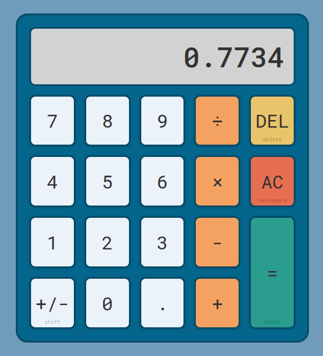

# Calculator

<!-- PROJECT LOGO -->
 

  

<h3 align="center">Calculator</h3>

  

    A web-based on-screen calculator.
     
    <a href="https://github.com/djsereno/Calculator/"><strong>Explore the docs »</strong></a>
     
    <a href="https://djsereno.github.io/Calculator/">Preview</a>
    ·
    <a href="https://github.com/djsereno/Calculator/issues">Report Bug</a>
    ·
    <a href="https://github.com/djsereno/Calculator/issues">Request Feature</a>
  

### Built With

- Javascript
- HTML/CSS

## Usage

Use your mouse to click the on-screen buttons. You can also use your keyboard as well (keyboard shortcuts are indicated on the buttons for buttons which do not have a corresponding key).

## Contact

Derek Sereno - [LinkedIn](https://www.linkedin.com/in/dereksereno/) - [Email](mailto:djsereno91@gmail.com)

Project Link: [https://github.com/djsereno/Calculator/](https://github.com/djsereno/Calculator/)

## Acknowledgments

- Favicon courtesy of [icons8](https://icons8.com/)
